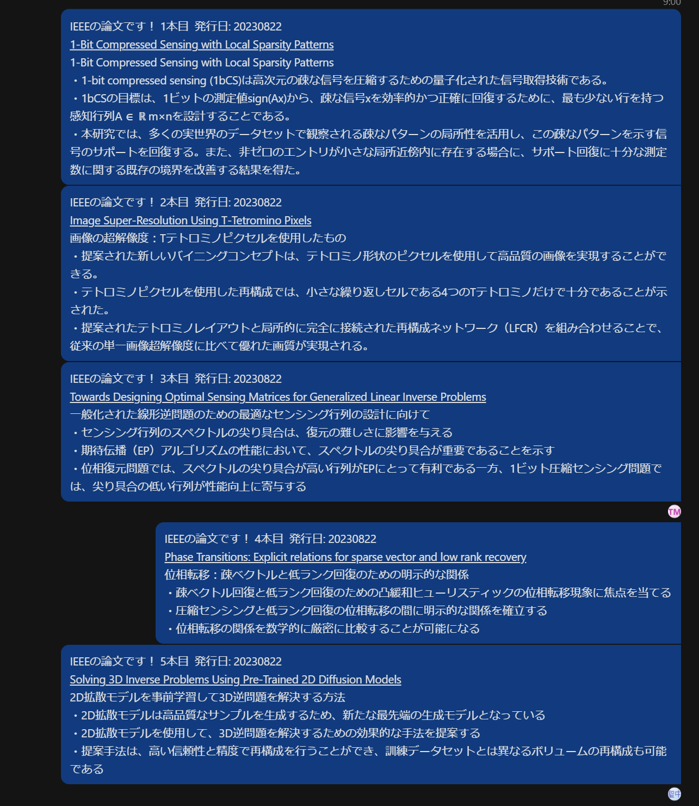

# Thesis ChatGPT

Thesis ChatGPT retrieves papers from research paper submission platforms like IEEE or ArXiv, utilizes the ChatGPT API for translation to Japanese and summarization, and then sends the results to Skype.

## Reference

I referred to [ieee_paper2slack](https://github.com/zushi0516/ieee_paper2slack).

## Installation

```bash
$ pip install -r requirements.txt
```

## Usage

```python
$ python ./thesis_chatgpt/main_IEEE.py
$ python ./thesis_chatgpt/main_arxiv.py
```

## example



## note

Output from ChatGPT may sometimes be generated in unintended formats.
